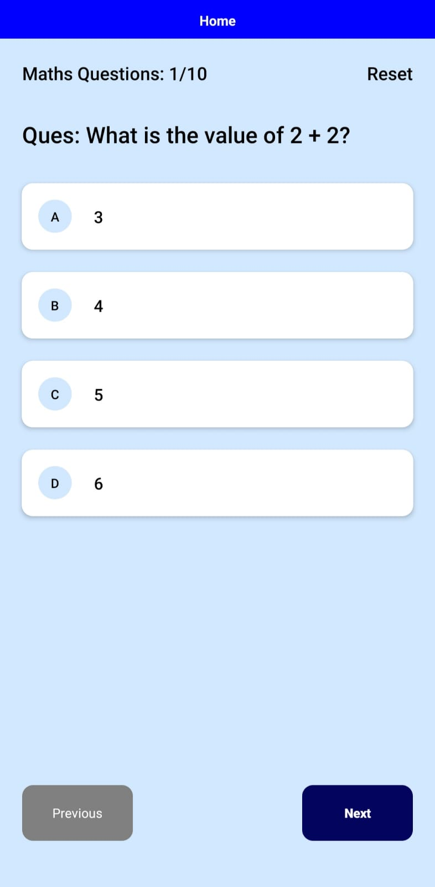

# ExamBuddy

Prototype [https://www.figma.com/file/ECkqpf4PXf6sA5bXmNY5Jq/ExamBuddy-Prototype?type=design&node-id=0%3A1&mode=design&t=23DR5S00YBcvNtJ4-1]
# ScreenSHots:

    
    
    
    
    
    
    
    

# INFORMATION ABOUT THE APP:
Welcome to ExamBuddy 10 - Your Ultimate Class 10 Education Companion! Are you a Class 10 student preparing for your exams under the Nagaland Board curriculum? Look no further! ExamBuddy 10 is here to revolutionize your learning experience and help you excel in your studies. 
**Key Features:**
1. Comprehensive Notes: Dive into our meticulously crafted notes for Maths and Science, designed specifically for Class 10 students following the Nagaland Board syllabus. Clear explanations and illustrative examples ensure a thorough understanding of key concepts.
2. Exam Preparation Made Easy: Access a treasure trove of resources to ace your exams. From past year question papers to sample question papers, ExamBuddy 10 provides you with ample practice opportunities to hone your skills and build confidence.
3. Blueprint for Success: Gain insights into the structure and marking scheme of question papers with our detailed blueprints. Understand the weightage of topics and optimize your study plan for maximum efficiency.
4. User-Friendly Interface: Navigate effortlessly through the app with our intuitive user interface. Organized sections make it easy to find the resources you need, saving you valuable time and effort. 
5. Interactive Feedback: Your feedback matters! Utilize the built-in feature to report any mistakes in the notes or flag any bugs encountered within the app. We're committed to continuously improving your learning experience.

Get Started Today! Don't let exam stress hold you back. With ExamBuddy 10, you have everything you need to succeed at your fingertips. Download the app now and embark on a journey towards academic excellence!
